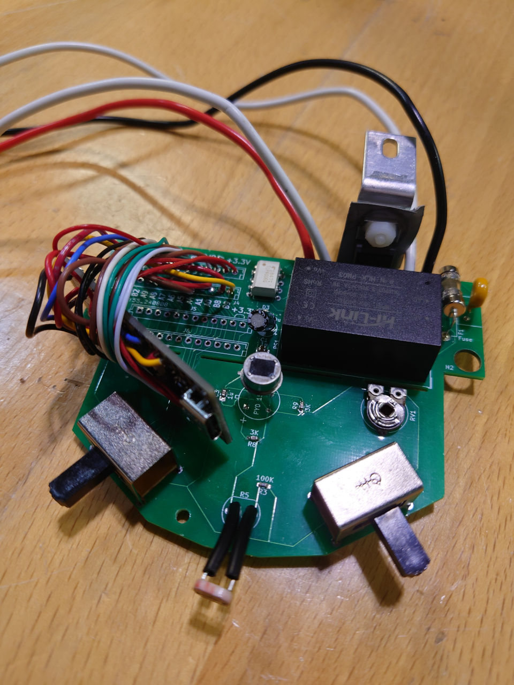
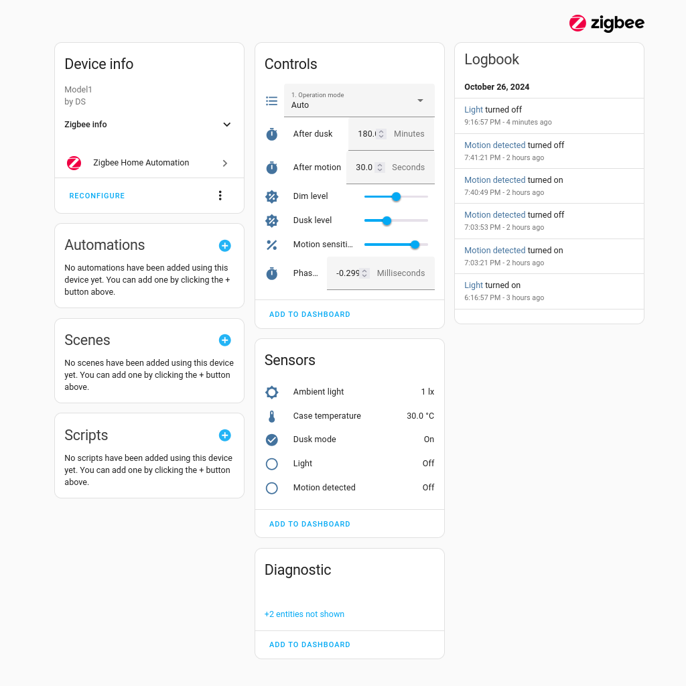

# stm32-zigbee-light
Remotely controlled deck light using a STM32WB55 and Homeassistant integration.

## Overview
This project is yet another automatic outdoor light. Some time back I have purchased a porch light with motion sensor, model 4190 by HeathZenith. My unit apparently was faulty, at least I could not make it to turn on and off at the right time. Instead of returning I have decided to turn it into a practice project to play with Zigbee and Homeassistant.

## Firmware
The firmware is written in C using STM32CubeIDE. I have preserved the link to the IOC file adding a few CPP macro hacks in the source.

The firmware implements 6 endpoints and 12 clusters:
- 6 Analog Output clusters
- 3 Binary Input clusters
- 1 Multistate Value cluster
- 1 Illuminance Measurement cluster
- 1 Temperature Measurement cluster

## Hardware
The replacement PCB board copies the shape of the original control board and fits in the same enclosure without modifications.

Also the switches, the pot, and the sensors are positioned to fit the holes in the enclosure and the outer case. The firmware reads the switches when not connected to the Zigbee network, otherwise remote settings take precedence.

My setup uses STM32WB55 based board from WeAct, but any other 3.3V controller can be used.

The light is controlled with the triac dimmer triggered by the optocoupler. This configuration is only capable of leading-edge dimming, so a compatible bulb should be used. Phase adjustment (in ms) is needed to compensate for the zero-crossing detection circuit latency (mainly due to the optocoupler).

## ZHA quirck
Homeassistant's Zigbee integration recognizes most clusters from the firmware except the Multistate Value. The quirk file should be copied to the Homeassistant zha_quirk directory for proper work.

(I have edited the auto-generated entity labels visible in the screenshot.)