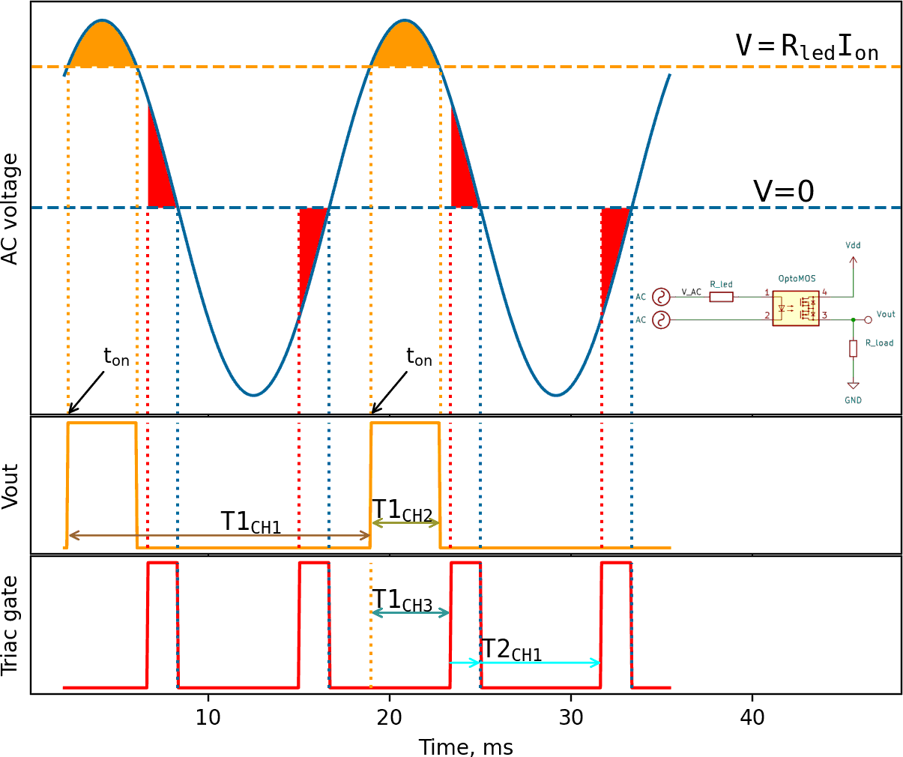

# Zero Crossing Detector

Many working detector schematics can be found on the internet. Here, I use a detector that likely has the simplest possible hardware implementation, with most of the work handled in software.

The following figure illustrates how this detector works:

Fig 1. AC sine wave triggers the optocoupler. The digital output is converted using STM32 timers. The resulting PWM output drives the triac.

## The Circuit

The optocoupler turns on when the LED current reaches or exceeds its trigger current Ion (orange lines in Fig 1). In my design, I use the TLP4006G, which has a typical Ion = 1mA. The exact value of Ion is not critical, nor is the value of the current-limiting resistor Rled. The resistor simply needs to provide sufficient current to turn on the optocoupler without damaging it. For my design, intended for 120V mains, I chose Rled = 80kΩ.

## The Timers

STM32 timers are configured to measure the resulting pulse length and period.

- **Timer 1, Channel 1** is configured in **Input Capture mode**. It is triggered by **TI1FP1** (PA8 on WB55) and resets on the rising edge of the same pin. The captured value stored in **TIM1_CCR1** represents the AC period.
  
- **Timer 1, Channel 2** is also configured in **Input Capture mode**, but in **Indirect mode**. It shares the input pin with **Channel 1** but is configured to reset on the **falling edge** of the optocoupler output. The captured value stored in **TIM1_CCR2** represents the output pulse length.

Knowing the AC period and optocoupler pulse duration allows us to calculate the zero-crossing moment:

tzc = ton + T1CH2 / 2 + T1CH1 / 4

Using this value, we can generate the correct TRIAC control waveform. Ideally, the TRIAC only requires a brief pulse to turn on and will stay on until the AC voltage crosses zero. However, extending the control pulse for the entire period the TRIAC needs to stay on improves output stability, especially for low-power loads like LED lights.

I use **2 additional timers** to generate the control pulses:

- **Timer 2, Channel 1** is set to **PWM mode** to generate pulses of the required duration. I set the period **TIM2_ARR** to match the AC wave half-period, as measured by **T1CH1**:

  T2ARR = T1CH1 / 2

  The compare value **TIM2_CCR1** is determined by the desired duty cycle d &isin; [0, 1]:

  T2CCR1 = d * T2ARR

- **Timer 1, Channel 3** is used to trigger **Timer 2**, which is configured to use ITR0. **T1CH3** runs in **PWM mode 2** and generates a trigger when the timer counter exceeds the compare value. The compare value **TIM1_CCR3** is set as shown in Fig 1 (dark green arrow): 

  T1CCR3 = tzc - T2CCR1

  This trigger starts **Timer 2**, which generates a PWM output (red lines in Fig 1)   on **PA0 (WB55)**. This PWM output drives the second gate of the **TPL4006G** optocoupler, activating the TRIAC.

This 2 timer setup is required because TLP4006G can detect only positive half-period of the AC wave. With a bidirectional optocoupler it should be possible to configure **T1CH3** to output the TRIAC control pulses directly. With the unidirectional optocoupler a second auto-reloaded timer is required, which will run through the negative half-period without re-triggering.

### Automatic Operation
**Timer 2** registers do not need to be updated on every AC wave period. **T1CH1** and **T1CH2** automatically capture and store the AC wave period and the Vout pulse duration. **T1CH3** and **T2CH1** are triggered automatically and generate PWM output without software intervention. Timers can be updated asynchronously within the sequencer loop; the new values will take effect on the next reload cycle.

## Phase Correction

The optocoupler introduces a noticeable switching delay that may affect TRIAC operation. For the **TPL4006G**, the on and off switching times are approximately **1ms**. To compensate for these delays, I introduced an adjustable phase correction time **tcorr**, which is exposed as a setting. The corrected zero-crossing time is:

tzc = ton + T1CH2 / 2 + T1CH1 / 4 + tcorr

### Determining tcorr
I started with **tcorr = 0** and adjusted it until my LED bulb reliably dimmed at a low PWM duty cycle **d = 10%**. For my circuit, I found **tcorr &approx; 0.3ms**.